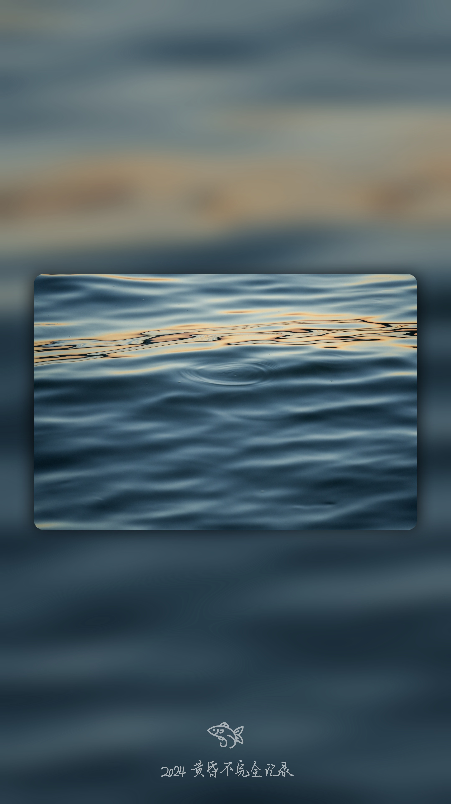

# 给照片加个相框

该项目主要功能为为每张照片添加带有高级模糊和主体突出的相框，实现不同设备拍摄的照片的比例统一，并添加您的专属水印。

该项目可用于简单的单色水印提取，并将其应用于批量处理图像，应用各种图像处理效果，并将处理后的图像保存到指定的输出文件夹中。

**示例**
| input (any ratio) | output (9:16) |
| - | - |
|  |  |
|  |  |

## 文件结构

```
photo-frame-project
├── input
│   └── (your input images)
├── output
├── src
│   ├── process_images.py
│   ├── extract_watermark.py
│   └── watermark
│       └── (your watermark .png)
├── requirements.txt
└── README.md
```

- **input/**: 存放待处理的输入图像。
- **output/**: 存放处理后的输出图像。
- **src/process_images.py**: 包含批量处理图像的逻辑。
- **requirements.txt**: 项目所需的Python库。
- **watermark/**: 加载你的水印png图像

## 使用说明

### 提取水印

1. 将需要处理的图像文件放置在与 `extract_watermark.py` 相同的目录中。
2. 运行脚本：
```sh
python extract_watermark.py
```
3. 输入图像文件的名称（包括扩展名，支持 `.png`, `.jpg`, `.jpeg` 格式）。
4. 脚本将生成一个新的图像文件，文件名为原图像文件名加上 `_watermark.png` 后缀。

**注意事项**
- 确保输入图像的背景为浅色，主体突出，以便正确提取水印。
- 提取的水印图像将保存为 PNG 格式，背景为透明，水印为纯白单色。


### 添加相框

1. 将待处理的图像放入 `input` 文件夹中。
2. 确保已安装项目所需的库，可以通过以下命令安装：
   ```
   pip install -r requirements.txt
   ```
3. 在目录`photo-frame-project`位置下运行 `src/process_images.py` 文件：
   ```
   cd ..../photo-frame-project
   python src/process_images.py
   ```
4. 处理后的图像将保存在 `output` 文件夹中。

**功能**

- 调整图像亮度
- 创建圆角矩形遮罩
- 添加阴影效果
- 添加水印

请根据需要修改代码中的参数。