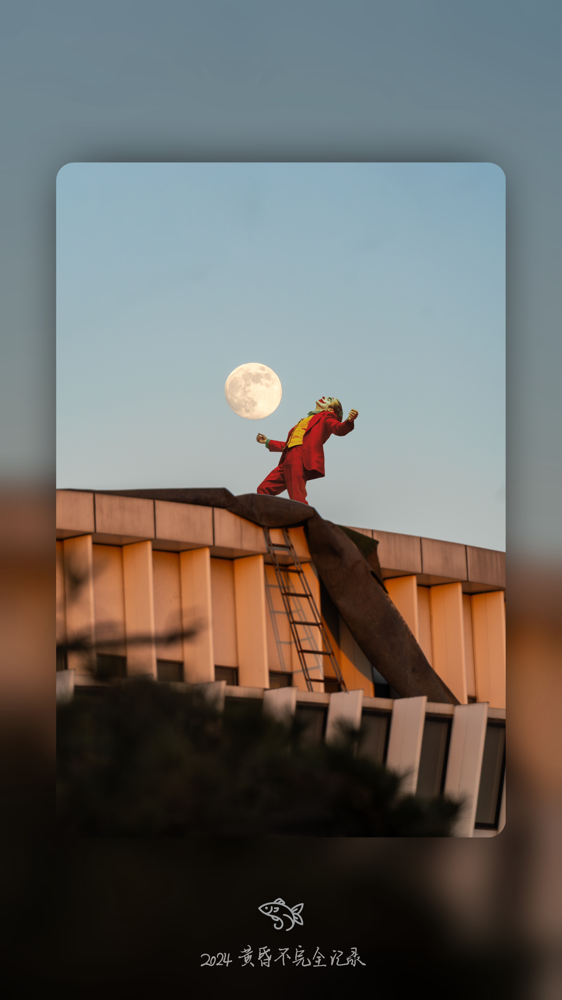
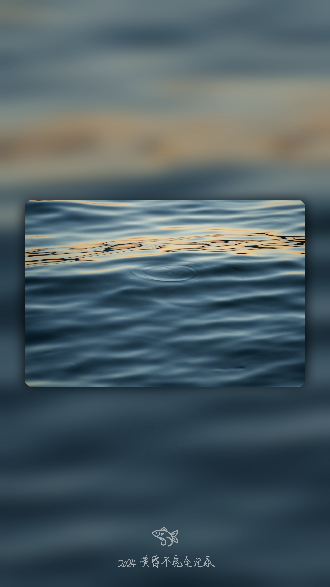

# Photo Frame Project

*[中文说明](./README-CHN.md)*

-----

This project is designed to add advanced blurred frames with highlighted subjects to photos, unify the aspect ratio of photos taken by different devices, and apply your custom watermark.

It also supports simple monochrome watermark extraction, batch processing of images, application of various image processing effects, and saving the processed images to a specified output folder.

**Examples**
| input (any ratio) | output (9:16) |
| - | - |
|  |  |
|  |  |

## File Structure

```
photo-frame-project
├── input
│   └── (your input images)
├── output
├── src
│   ├── process_images.py
│   ├── extract_watermark.py
│   └── watermark
│       └── (your watermark .png)
├── requirements.txt
└── README.md
```

- **input/**: Folder for input images to be processed.
- **output/**: Folder for storing processed output images.
- **src/process_images.py**: Script for batch image processing.
- **requirements.txt**: Lists required Python libraries.
- **watermark/**: Folder containing your watermark image (PNG format).

## Instructions

### Extract Watermark

1. Place the image file containing the watermark in the same directory as `extract_watermark.py`.
2. Run the script:
```sh
python extract_watermark.py
```
3. Enter the name of the input image file, including the extension (supports `.png`, `.jpg`, `.jpeg`).
4. The script generates a new image file with the extracted watermark, saved with the original filename appended with `_watermark.png`.

**Notes**
- Ensure that the input image has a light background and a prominent subject to facilitate correct watermark extraction.
- The extracted watermark image is saved as a transparent PNG with a pure white monochrome watermark.


### Add Photo Frame

1. Place the images to be processed into the `input` folder.
2. Install required dependencies using:
   ```
   pip install -r requirements.txt
   ```
3. Run the `src/process_images.py` script from the `photo-frame-project` directory:
   ```
   cd ..../photo-frame-project
   python src/process_images.py
   ```
4. Processed images are saved in the `output` folder.

**Features**

- Adjust image brightness
- Create rounded rectangle masks
- Add shadow effects
- Apply watermarks

You can customize parameters in the script as needed.

